# VX

[](https://github.com/MisterEkole/vx-rs/actions/workflows/ci.yml)
[](https://crates.io/crates/vx-vision)
[](LICENSE)

A computer vision library in Rust that talks directly to Apple Silicon GPUs through Metal Shading Language.

## Why

OpenCV and similar libraries treat the GPU as a separate device — data gets copied from CPU memory to GPU memory and back, over and over. On Apple Silicon this is wasteful because the CPU and GPU share the same physical memory (Unified Memory Architecture). VX skips the copies entirely.

The library uses Rust bindings to Metal via `objc2-metal`, giving us type-safe GPU access with Rust's ownership model enforcing buffer safety at compile time. Metal Shading Language (MSL) kernels run the actual pixel-level computation on the GPU, while Rust handles orchestration, memory management, and a clean public API.

The result: real-time classical vision algorithms with zero-copy memory, no C++ interop layer, and no Xcode project required.

## Architecture

VX is a three-layer stack:

<p align="center">
  
</p>

**Naming convention:** In this codebase, *shaders* refer to the MSL functions that run on the GPU (`shaders/*.metal`), and *kernels* refer to the Rust bindings that orchestrate them (`src/kernels/*.rs`).

**Memory Layer** (`vx-core`) manages shared GPU/CPU buffers. `UnifiedBuffer<T>` wraps Metal buffers with type safety, and `GpuGuard<T>` prevents CPU access while a buffer is in-flight on the GPU.

**Kernel Layer** (`vx-vision`) contains Rust bindings for each MSL shader. Each kernel is a struct holding a compiled pipeline — constructed once, dispatched cheaply per frame. The `Context` and `Texture` wrappers hide all Metal internals so users never import `objc2-metal`.

**Application Layer** is your code. The API looks like this:

```rust
use vx_vision::Context;
use vx_vision::kernels::fast::{FastDetector, FastDetectConfig};
use vx_vision::kernels::harris::{HarrisScorer, HarrisConfig};

let ctx = Context::new()?;
let fast = FastDetector::new(&ctx)?;
let harris = HarrisScorer::new(&ctx)?;

let texture = ctx.texture_gray8(img.as_raw(), w, h)?;
let corners = fast.detect(&ctx, &texture, &FastDetectConfig::default())?;
let scored = harris.compute(&ctx, &texture, &corners.corners, &HarrisConfig::default())?;
```

No `unsafe` in user code. No Metal imports. No GPU boilerplate.

## Available Kernels

| Category | Kernels |
|---|---|
| **Feature Detection** | FAST-9, Harris, ORB descriptors, DoG/SIFT-like pipeline |
| **Image Processing** | Gaussian blur, bilateral filter, Sobel, Canny edge, morphology (erode/dilate), threshold (binary/Otsu), histogram (compute/equalize), color conversion |
| **Geometry** | Resize (bilinear), image pyramid, warp (affine/perspective), homography, lens undistortion |
| **Analysis** | Template matching (NCC), Hough lines, integral image, distance transform (JFA), connected components |
| **Motion & Stereo** | KLT optical flow, dense flow, stereo matching, brute-force descriptor matching |
| **3D Reconstruction** | SGM stereo, depth filter (bilateral/median), depth inpaint, depth-to-cloud, normal estimation, outlier removal, voxel downsample, TSDF fusion (integrate/raycast), marching cubes, triangulation |
| **Visualization** | Point cloud renderer, mesh renderer (Phong), depth colorize (turbo/jet/inferno) |
| **Utilities** | Non-maximum suppression, texture pool, pipeline batching, PLY/OBJ export |

## Building

Requires macOS with Xcode command line tools (`xcode-select --install`).

```
cargo build
cargo test
cargo run --example fast_demo -- path/to/image.png
```

The build script automatically compiles all `.metal` shaders into a single metallib and embeds it in the binary.

See the [documentation](docs/src/getting-started.md) for a detailed setup guide.

## Feature Flags

The 3D reconstruction and visualization APIs are behind feature flags to keep default builds lean:

| Flag | What it enables |
|---|---|
| `reconstruction` | 3D types, depth kernels, point cloud ops, TSDF fusion, meshing, export |
| `visualization` | Point cloud and mesh renderers, offscreen render targets |
| `datasets` | TUM RGB-D, EuRoC, KITTI dataset loaders |
| `full` | Everything |

```
cargo build --features reconstruction
cargo run --features full --example tsdf_fusion_demo
```

## Documentation

Full documentation is available at **[misterekole.github.io/vx-rs](https://misterekole.github.io/vx-rs/)**.

- [Getting Started](https://misterekole.github.io/vx-rs/getting-started.html) — installation, core concepts, first program
- [Architecture](https://misterekole.github.io/vx-rs/architecture.html) — three-layer stack, shader-kernel contract, memory model
- [API Reference](https://misterekole.github.io/vx-rs/api/detection.html) — every kernel with usage examples
- [3D Reconstruction](https://misterekole.github.io/vx-rs/api/reconstruction.html) — depth estimation, TSDF fusion, meshing, point clouds
- [Stereo-to-Mesh Tutorial](https://misterekole.github.io/vx-rs/reconstruction-guide.html) — end-to-end reconstruction pipeline
- [Pipeline & Performance](https://misterekole.github.io/vx-rs/performance.html) — batching, TexturePool, optimization
- [Adding a Kernel](https://misterekole.github.io/vx-rs/adding-a-kernel.html) — contributor guide

## License

MIT
