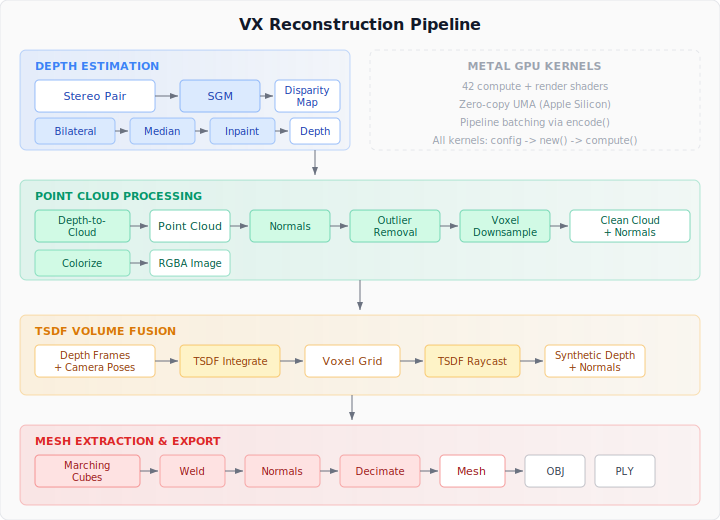

# Stereo-to-Mesh Pipeline

This guide walks through the complete 3D reconstruction pipeline available in VX: from stereo images to a triangle mesh, covering every kernel in the reconstruction module.

<p align="center">
  
</p>

## Step 1: Depth Estimation

Start with a rectified stereo pair and produce a dense disparity map using Semi-Global Matching:

```rust
use vx_vision::kernels::sgm::{SGMStereo, SGMStereoConfig};

let sgm = SGMStereo::new(&ctx)?;
let config = SGMStereoConfig::new(128);
let disparity = ctx.texture_output_r32float(width, height)?;

sgm.compute_disparity(&ctx, &left_image, &right_image, &disparity, &config)?;
```

To convert disparity to depth: `depth = focal_length × baseline / disparity`.

## Step 2: Depth Cleanup

Apply edge-preserving bilateral filtering and hole filling:

```rust
use vx_vision::kernels::depth_filter::{DepthFilter, DepthFilterConfig};
use vx_vision::kernels::depth_inpaint::{DepthInpaint, DepthInpaintConfig};

let filter = DepthFilter::new(&ctx)?;
let inpaint = DepthInpaint::new(&ctx)?;

// Bilateral: smooth while preserving edges
let filtered = ctx.texture_output_r32float(w, h)?;
filter.apply_bilateral(&ctx, &depth, &filtered, &DepthFilterConfig::new(3, 5.0, 0.05))?;

// Fill holes
let filled = ctx.texture_intermediate_r32float(w, h)?;
inpaint.apply(&ctx, &filtered, &filled, &DepthInpaintConfig::default())?;
```

## Step 3: Point Cloud Generation

Unproject the depth map to 3D:

```rust
use vx_vision::kernels::depth_to_cloud::{DepthToCloud, DepthToCloudConfig};
use vx_vision::types_3d::{CameraIntrinsics, DepthMap};

let d2c = DepthToCloud::new(&ctx)?;
let intrinsics = CameraIntrinsics::new(fx, fy, cx, cy, width, height);
let depth_map = DepthMap::new(depth_texture, intrinsics, 0.1, 10.0)?;

let cloud = d2c.compute(&ctx, &depth_map, Some(&rgb_texture), &DepthToCloudConfig::new(0.1, 10.0))?;
```

## Step 4: Point Cloud Processing

Clean the cloud: estimate normals, remove outliers, downsample:

```rust
use vx_vision::kernels::normal_estimation::{NormalEstimator, NormalEstimatorConfig};
use vx_vision::kernels::outlier_filter::{OutlierFilter, OutlierFilterConfig};
use vx_vision::kernels::voxel_downsample::{VoxelDownsample, VoxelDownsampleConfig};

let estimator = NormalEstimator::new(&ctx)?;
let normals = estimator.compute(&ctx, &cloud, &NormalEstimatorConfig::default())?;

let filter = OutlierFilter::new(&ctx)?;
let clean = filter.filter(&ctx, &cloud, &OutlierFilterConfig::default())?;

let ds = VoxelDownsample::new(&ctx)?;
let downsampled = ds.downsample(&ctx, &clean, &VoxelDownsampleConfig::new(0.01))?;
```

## Step 5: TSDF Fusion (Multi-Frame)

For multiple depth frames, fuse them into a volumetric representation:

```rust
use vx_vision::kernels::tsdf::{TSDFVolume, TSDFConfig};

let mut config = TSDFConfig::default();
config.resolution = [256, 256, 256];
config.voxel_size = 0.005;
let tsdf = TSDFVolume::new(&ctx, config)?;

for (depth_frame, camera_pose) in frames.iter() {
    tsdf.integrate(&ctx, depth_frame, camera_pose)?;
}
```

## Step 6: Mesh Extraction

Extract a triangle mesh from the TSDF volume using Marching Cubes:

```rust
use vx_vision::kernels::marching_cubes::{MarchingCubes, MarchingCubesConfig};

let mut mesh = MarchingCubes::extract(tsdf.volume(), &MarchingCubesConfig::default());
mesh.compute_normals();
mesh.weld_vertices(0.001);
```

## Step 7: Export

```rust
use vx_vision::export;

export::write_obj("reconstruction.obj", &mesh)?;
export::write_ply_ascii("cloud.ply", &cloud)?;
```

## Visualization

Render results to offscreen textures for inspection:

```rust
use vx_vision::render_context::{Camera, RenderTarget};
use vx_vision::renderers::mesh_renderer::MeshRenderer;

let renderer = MeshRenderer::new(&ctx)?;
let target = RenderTarget::new(&ctx, 1920, 1080)?;
let camera = Camera { position: [0.0, 0.0, 3.0], ..Camera::default() };

renderer.render(&ctx, &mesh, &camera, &target)?;
let pixels = target.read_rgba8();
```

## Feature Flags

| Flag | What it enables |
|------|----------------|
| `reconstruction` | All 3D types, depth kernels, point cloud ops, TSDF, meshing |
| `visualization` | Point cloud and mesh renderers, render targets |
| `datasets` | TUM, EuRoC, KITTI dataset loaders |
| `full` | Everything |

## Performance Notes

- **SGM stereo** is the most expensive kernel — O(width × height × disparities). Use smaller disparity ranges when possible.
- **TSDF integration** is fast (~1ms per frame for 128³ volumes) thanks to UMA zero-copy.
- **Marching Cubes** runs on CPU but reads directly from GPU shared memory. A 256³ volume takes ~500ms.
- **Point cloud operations** (normals, outliers) are O(N²) brute-force for k-NN. For clouds >100K points, consider reducing with voxel downsampling first.
